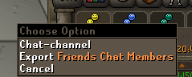
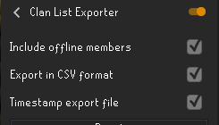

# Clan List Exporter

A plugin to export clan or friends chat to a file with various options

## How to use

Right click either the Friends Chat or Clan Chat icons and select to export:

This will result in a file being created with the exported lists in the clanlistexports folder in your .runelite folder.
# Config options

The include offline members will export everyone from clan chat regardless of their online/offline status

By default the exported list is one name per line, however this can be changed to a CSV file with the CSV format option

Each file can optionally be timestamped to prevent the last the most recent export being replaced